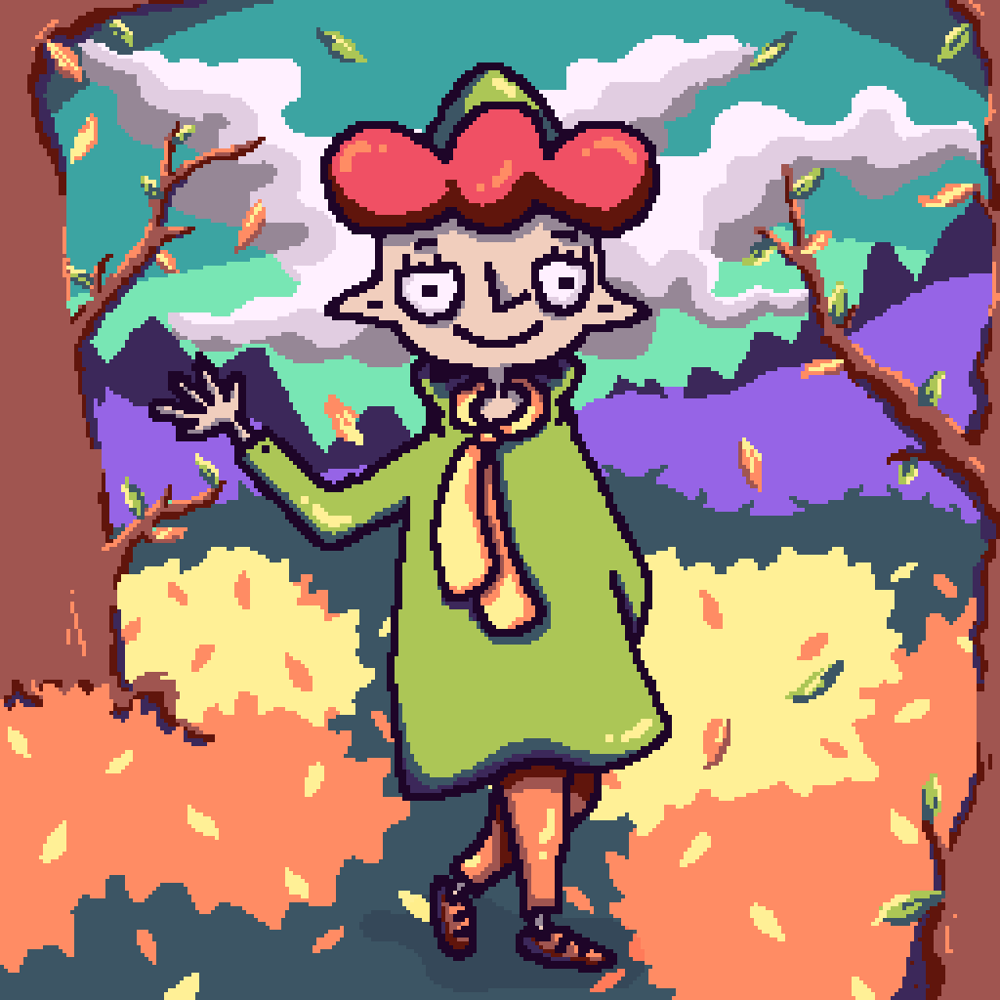

I am a game developer and artist. The main platform for my games is the web, it allows you to play my games on any device that supports javascript!

## 🌱 My skills!
- Javascript, Webpack, Vue, EJS, Node.JS
- HTML, CSS/SCSS/SASS
- Python (Messager Bots (VK, Telegram), Parsers)
- Lua (PICO8, TIC-80, Love2D)

## 🔭 I’m currently working
I am working on my own game development engine and actively using it for my current projects on github.com/wmgcat/42eng. I release games on my website wmgcat.net and on wmgcat.itch.io